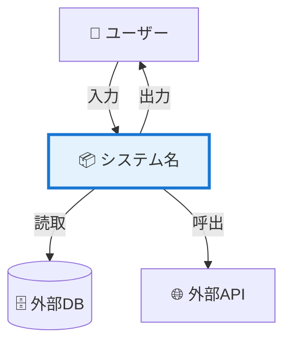
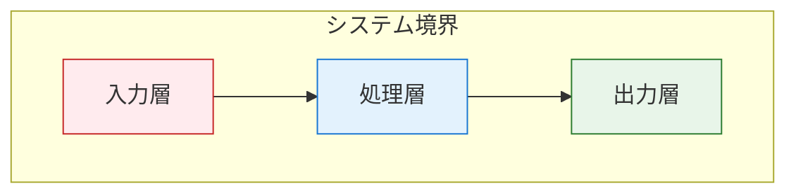
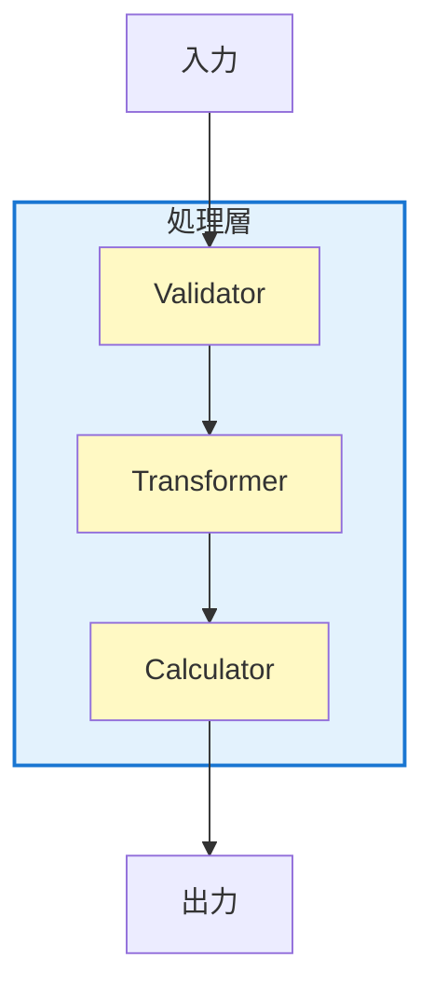
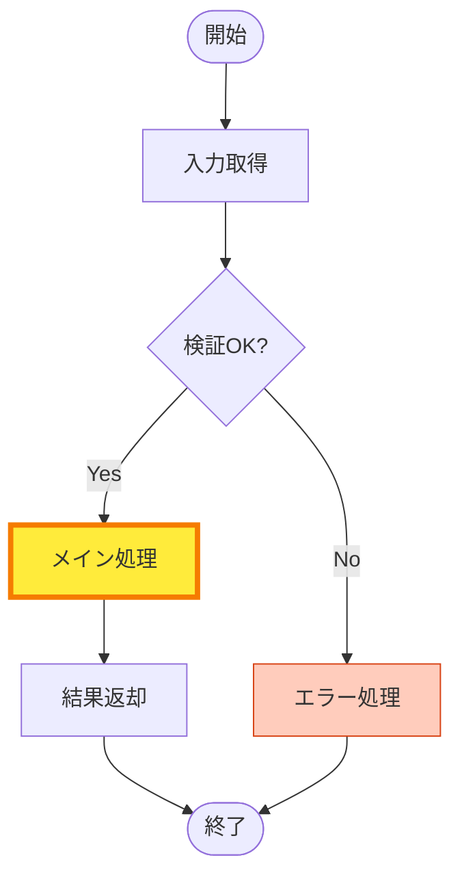

# 処理フロー可視化ドキュメントスキル

AI生成コードの**理解負債**を解消するための階層的ドキュメント作成。
**C4 Model + Progressive Disclosure**で「コードを読まなくても処理が詳細に理解できる」ドキュメントを実現。

## 理解負債とは

AI生成コードは動作するが、以下が不明確になりやすい:
- **Why**: なぜこの実装を選んだか
- **Theory**: 背後にある理論・数式
- **Assumption**: 前提条件・制約
- **Verification**: 正しさの検証方法
- **Flow**: 処理全体のどこにいるのか

## ドキュメント構造

```
_docs/processing-flow/{issue-name}/{yyyyMMddHHmm}.md
```

NOTE: The issue name can be obtained from the branch name. Branch names are like {layer}/{issue-name} or {issue-name}.

## C4 Model階層構造（必須）

業界標準のC4 Modelに基づく4レベル階層:

| Level | 名称 | 焦点 | 要素数 | 詳細度 |
|-------|------|------|--------|--------|
| **1** | **Context** | システム全体 | 1個 | 最も抽象的 |
| **2** | **Container** | 主要レイヤー | 3-5個 | 高レベル分割 |
| **3** | **Component** | 内部構造 | 5-10個 | コンポーネント |
| **4** | **Code** | メソッド詳細 | 1メソッド | 最も具体的 |

> **7±2の原則**: 各レベルで3-7要素に抑え、認知負荷を削減

### セクション構成

```markdown
# 処理フロードキュメント

## 1. 概要
- システムの目的と全体像
- 主要な入出力
- ステークホルダー

## 2. 理論的背景
- 使用アルゴリズムの数式
- 前提条件・制約
- 参考文献

## 3. アーキテクチャ全体像（C4 Level 1-3）

### 3.1 Level 1: システムコンテキスト
- システム境界の可視化
- 外部システムとの関係

### 3.2 Level 2: コンテナ分解（主要レイヤー）
- 3-5個の主要レイヤー
- レイヤー間依存関係

### 3.3 Level 3: コンポーネント構成
- 各レイヤーの内部構造
- 主要クラス・モジュール

## 4. 処理フロー詳細（Progressive Disclosure）

### 4.1 データ整列層
#### 4.1.1 コンテキスト図（親フロー + ハイライト）
#### 4.1.2 詳細フロー
#### 4.1.3 メソッド辞書

### 4.2 シミュレーション層
#### 4.2.1 コンテキスト図（親フロー + ハイライト）
#### 4.2.2 詳細フロー
#### 4.2.3 メソッド辞書

（他のレイヤーも同様）

## 5. 決定根拠（ADR）

## 6. 検証ポイント

## Appendix A: メソッド詳細辞書
各メソッドの完全な実装解説

## Appendix B: 決定記録詳細

## Appendix C: 検証チェックリスト
```

## Progressive Disclosure パターン

### 3段階の情報開示

```
概要 (Overview)
  ↓ セクション展開
詳細フロー (Detail Flow)
  ↓ サブセクション展開
メソッド解説 (Method Explanation)
```

**各段階の役割**:
1. **概要**: 全体像を把握（What）
2. **詳細フロー**: 処理順序を理解（How）
3. **メソッド解説**: 実装を確認（Why + Code）

### セクション階層ルール

- `##` レベル2: メインセクション（Level 1-2相当）
- `###` レベル3: サブセクション（Level 3相当）
- `####` レベル4: コンポーネント詳細
- `#####` レベル5: メソッド個別解説

## コンテキストハイライト（重要）

### 親フローでの現在位置の可視化

各詳細セクションの冒頭に**コンテキスト図**を配置:

```markdown
#### 4.2.1 コンテキスト図

現在の位置: **シミュレーション層**

\```mermaid
flowchart TB
    Input["入力層"]
    DataAlign["データ整列層"]
    Simulation["シミュレーション層"]
    Output["出力層"]

    Input --> DataAlign --> Simulation --> Output

    style Input fill:#e3f2fd,stroke:#1976d2
    style DataAlign fill:#e3f2fd,stroke:#1976d2
    style Simulation fill:#ffeb3b,stroke:#f57c00,stroke-width:4px
    style Output fill:#e3f2fd,stroke:#1976d2
\```

**ハイライト**: 黄色で強調された「シミュレーション層」が現在の解説対象です。
```

### Mermaidハイライト技法

**通常ノード**:
```
style NodeName fill:#e3f2fd,stroke:#1976d2
```

**ハイライトノード**（現在位置）:
```
style CurrentNode fill:#ffeb3b,stroke:#f57c00,stroke-width:4px
```

**完了ノード**（オプション）:
```
style CompletedNode fill:#c8e6c9,stroke:#388e3c
```

### 色の意味

| 色 | 意味 | 用途 |
|----|------|------|
| `#ffeb3b` (黄) | **現在位置** | 解説中のノード |
| `#e3f2fd` (青) | 通常 | その他のノード |
| `#c8e6c9` (緑) | 完了 | 前のセクションで解説済み |
| `#ffccbc` (橙) | エラー/例外 | エラーハンドリング |

### レイヤー別の色分け

| レイヤー | 背景色 | 用途 |
|---------|--------|------|
| 入力 | `#ffebee` (ピンク) | 生データ、外部入力 |
| 検証 | `#fff9c4` (薄黄) | DTO検証、クリーニング |
| 処理 | `#e3f2fd` (青) | メイン処理 |
| 出力 | `#e8f5e9` (緑) | 結果、保存 |

## メソッドレベル解説テンプレート

### Appendix A用の詳細テンプレート

```markdown
### メソッド名: `method_name()`

**場所**: [file.py:123](src/domain/file.py#L123)

**シグネチャ**:
\```python
def method_name(
    param1: Type1,
    param2: Type2,
) -> ReturnType:
    ...
\```

**目的**:
{1-2文でメソッドの責務を説明}

**アルゴリズム**:
1. {ステップ1の説明}
2. {ステップ2の説明}
3. {ステップ3の説明}

**数値例**:
\```
入力: param1=10, param2=[1, 2, 3]
↓
ステップ1: 初期化 → state=0
ステップ2: 計算 → result=sum([1,2,3])*10=60
ステップ3: 正規化 → output=60/10=6
↓
出力: 6
\```

**実装コード**:
\```python
def method_name(param1: Type1, param2: Type2) -> ReturnType:
    # ステップ1: 初期化
    state = 0

    # ステップ2: 計算
    result = sum(param2) * param1

    # ステップ3: 正規化
    output = result / param1

    return output
\```

**計算量**: O(n) - param2のサイズに線形

**副作用**: なし（純粋関数）

**例外**:
- `ValueError`: param1が0の場合
- `TypeError`: param2がiterableでない場合

**テストケース**: [test_file.py:45](tests/test_file.py#L45)

**関連メソッド**:
- `helper_method()`: ステップ2で使用
- `validate_input()`: 入力検証
```

### 本文での簡易言及

メソッド辞書への参照のみ:

```markdown
##### `method_name()`

**目的**: {1行で説明}

**詳細**: [Appendix A: method_name()](#appendix-a-メソッド詳細辞書) 参照
```

## 理論的背景セクション（既存維持）

### 数式の明文化

```markdown
## 2. 理論的背景

### 使用アルゴリズム

**アルゴリズム名**

数式:
$$
y = f(x; \theta)
$$

**なぜこのアルゴリズムか**:
- 理由1: {説明}
- 理由2: {説明}

### 前提条件

| 前提 | 根拠 | 検証方法 |
|------|------|---------|
| 条件1 | 理由 | 検証スクリプト |

### 参考文献・実装根拠

- 理論: [論文名] (著者, 年)
- 実装: [ライブラリ/フレームワーク]
- プロジェクト固有: {独自の工夫}
```

## 決定根拠（ADR）セクション（既存維持）

### ADR形式

```markdown
## 5. 決定根拠

### DR-001: {決定のタイトル}

**状況**: {どんな状況で決定が必要だったか}

**選択肢**:
1. 選択肢A
2. 選択肢B
3. 選択肢C

**決定**: {選択肢B}

**理由**:
- {理由1}
- {理由2}

**却下理由**:
- 選択肢A: {却下理由}
- 選択肢C: {却下理由}

**検証**: {決定の正しさを示すデータ}
```

## 検証ポイント（既存維持）

```markdown
## 6. 検証ポイント

### 6.1 データ品質検証

| チェック項目 | 基準 | 実行方法 | 結果 |
|-------------|------|---------|------|
| 欠損率 | < 5% | `df.isnull().mean()` | ✓ |

### 6.2 理論的妥当性

□ 前提条件を満たすか
□ 特徴量リークがないか
□ 統計検定の前提が満たされるか
```

## Mermaidダイアグラム詳細仕様

### Level 1: システムコンテキスト図



### Level 2: コンテナ分解図



### Level 3: コンポーネント詳細図



### Level 4: メソッドフロー図（詳細）



## チェックリスト

ドキュメント作成時の確認:

```
階層構造:
□ C4 Model 4レベル全てが存在するか
□ 各レベルで3-7要素に抑えられているか
□ Level 1 → Level 4へ段階的にドリルダウンできるか

Progressive Disclosure:
□ 各セクションに「コンテキスト図」があるか
□ 親フローで現在位置がハイライトされているか
□ 概要 → 詳細 → コードの順で展開されているか

理解負債対策:
□ Why（決定理由）が記録されているか
□ Theory（理論・数式）が明記されているか
□ Assumption（前提条件）が列挙されているか
□ Verification（検証方法）が記載されているか

メソッド解説:
□ Appendix Aにメソッド辞書があるか
□ 各メソッドに数値例があるか
□ アルゴリズムがステップ分解されているか
□ 計算量・副作用が明記されているか

Mermaid図:
□ ハイライト色が統一されているか（#ffeb3b）
□ 色分けで層が識別できるか
□ リンクが有効か（行番号付き）
□ 7±2要素ルールが守られているか
```

## ベストプラクティス

### 認知負荷の管理

**Good**:
- 各図で3-7要素
- 階層的に分割
- ハイライトで現在位置を明示

**Bad**:
- 1つの図に20要素
- フラットな構造
- 現在位置が不明

### 情報の粒度

| レベル | 粒度 | 例 |
|--------|------|-----|
| Level 1 | システム全体 | "発注シミュレータ" |
| Level 2 | レイヤー | "データ整列層" |
| Level 3 | コンポーネント | "SKUアライナー" |
| Level 4 | メソッド | `align_sku_ids()` |

### リンクの活用

```markdown
- メイン本文: 簡潔に（1-2行）+ Appendix参照リンク
- Appendix: 完全な詳細解説
```

### メソッド・ファイルへのリンク形式【必須】

**重要**: リンクはドキュメントファイルからの**相対パス**で記載すること。

ドキュメント配置例: `_docs/processing-flow/{issue-name}/YYYYMMDDHHMM.md`

**ソースファイルへのリンク**（相対パス）:
```markdown
[file.py:123](../../../src/domain/file.py#L123)
[`method_name()`](../../../src/processor/foo.py#L45)
```

**テストファイルへのリンク**（相対パス）:
```markdown
**テストケース**: [test_file.py:45](../../../tests/test_file.py#L45)
```

**ルール**:
- メソッド名は必ずバッククォートで囲む: `` `calculate()` ``
- 行番号は `#L{行番号}` 形式
- 相対パスは `_docs/processing-flow/{issue-name}/` からの相対パス（通常 `../../../` でプロジェクトルートへ）

## 詳細リファレンス

- **C4 Model詳細**: [references/c4-model.md](references/c4-model.md)
- **Mermaidスタイルガイド**: [references/mermaid-styles.md](references/mermaid-styles.md)
- **メソッド解説テンプレート**: [references/method-template.md](references/method-template.md)
- **決定記録（ADR）**: [references/decision-record.md](references/decision-record.md)
- **検証チェックリスト**: [references/verification.md](references/verification.md)
